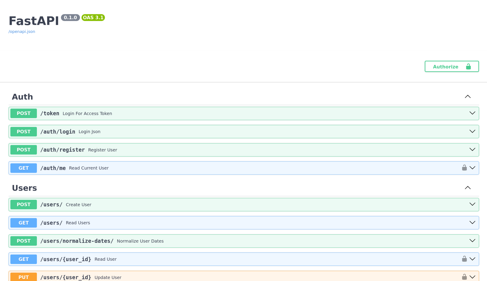
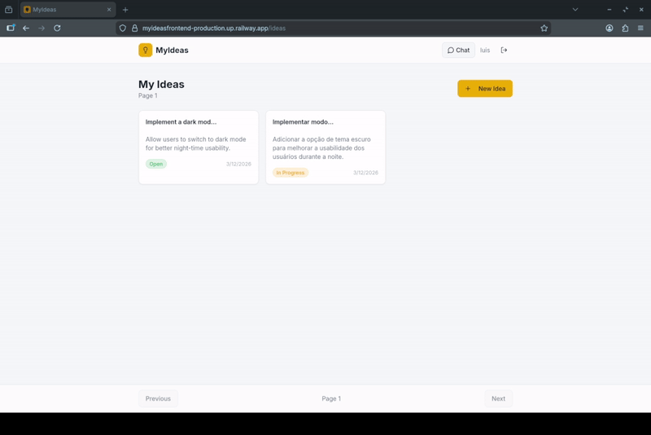
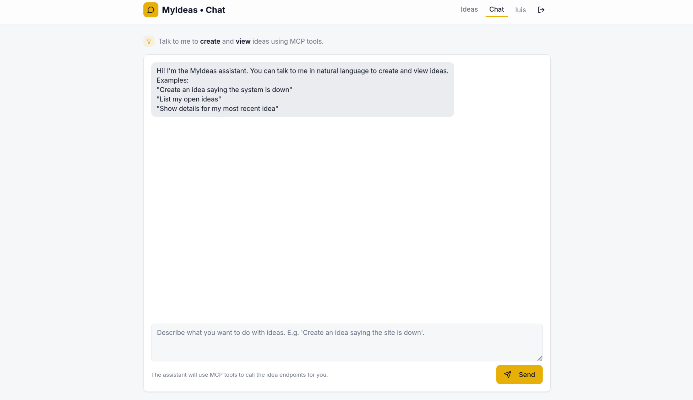
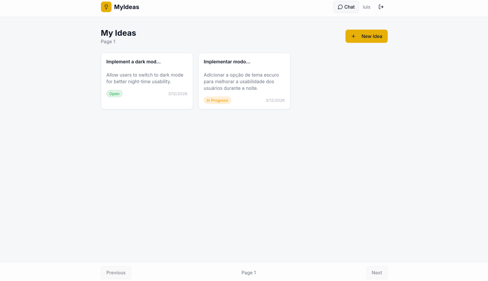
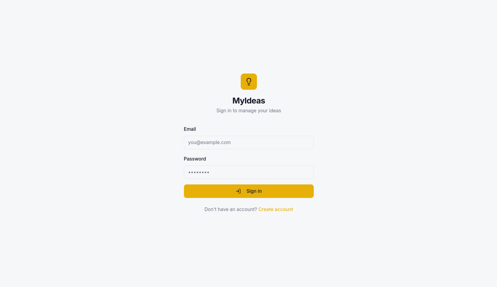

<h1 align="center">MyIdeas Frontend</h1>
<h3 align="center">AI-powered Idea Management Interface</h3>

<p align="center">
  
  
  
  
  
</p>

---

<p align="center">
  
</p>

---

## Overview

MyIdeas Frontend is a modern React application that provides an intuitive interface for interacting with the MyIdeas API.

The interface was initially generated using AI-assisted tools and later refined manually, resulting in a clean, functional, and user-focused experience.

It allows users to create, explore, and refine ideas through an AI-powered chat system, transforming raw thoughts into structured and persistent ideas.

---

## Demo

<p align="center">
  
</p>

---

## Key Highlights

- AI-assisted UI generation  
- Manual refinements and customization  
- Clean and responsive interface  
- Real-time communication with backend  
- AI-powered chat experience  
- Idea creation and management  
- Image upload support  
- JWT-based authentication  

---

## Tech Stack

- React  
- Vite  
- JavaScript  
- Lovable (AI UI generation)  
- Cursor (code refinement and improvements)  
- Axios / Fetch API  

---

## Screenshots

### Chat Interface
<p align="center">
  
</p>

### Ideas Dashboard
<p align="center">
  
</p>

### Authentication
<p align="center">
  
</p>

---

## Features

### Authentication
- User login  
- JWT token handling  
- Protected routes  

### AI Chat
- Real-time chat with AI  
- Idea refinement workflow  
- Save ideas directly from conversation  

### Ideas Management
- View ideas  
- Edit ideas  
- Delete ideas  
- Attach images  

### UI/UX
- Responsive layout  
- Clean design  
- User-friendly flow  

---

## Project Structure

```
src/
 ├── components/
 ├── pages/
 ├── services/
 ├── hooks/
 ├── context/
 ├── utils/
 └── App.jsx
```

---

## How It Works

1. User logs in  
2. Starts interacting with AI  
3. Refines an idea through chat  
4. Saves the idea  
5. Manages ideas in dashboard  

---

## Running the Project

### Install dependencies

```bash
npm install
```

---

### Run development server

```bash
npm run dev
```

---

### Access

```
http://localhost:5173
```

---

## Environment Variables

Create a `.env` file:

```
VITE_API_URL=http://localhost:8000
```

---

## Backend Integration

This frontend consumes the MyIdeas Backend API:

```
https://github.com/LuisOctavioGSeror/MyIdeasBackend
```

---

## Why This Project Matters

This project combines AI-assisted development with manual engineering.

The UI was initially generated using AI tools and then refined, demonstrating the ability to:
- leverage modern AI tooling  
- understand and improve generated code  
- integrate complex backend systems  

---

## Future Improvements

- UI/UX refinements  
- Dark mode  
- Better animations  
- Idea categorization  
- Mobile optimization  

---

## License

Open-source for study and experimentation.
